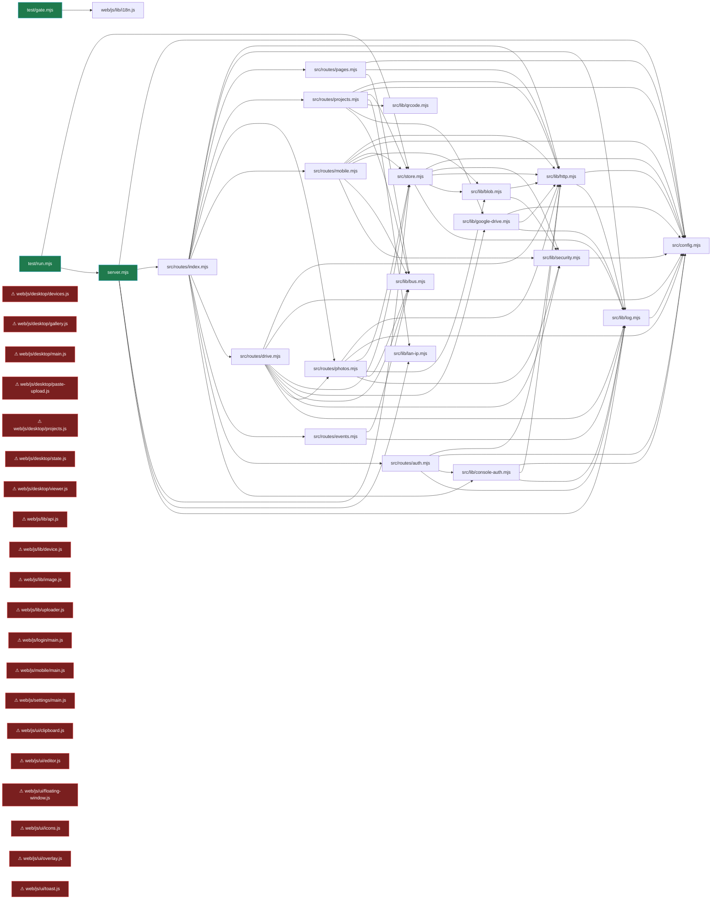

# photo-relay 架構書
> 自動半由 `tools/arch-book` 維護（AUTO 區）；敘事半（願景/決策/下一步/口語紀錄）由人＋AI 維護，重掃不覆蓋。

<!-- ARCH:AUTO:START （本區由 tools/arch-book 自動產生·請勿手改；敘事區在下方，regen 會保留） -->

## 🗂 結構總覽（自動）
> 掃描：products\photo-relay · 引擎 `tools/arch-book/scan.mjs`

| 檔案 | 程式模組 | 進入點 | 依賴邊 | 疑似死代碼 | 測試檔 | 總行數 |
|---|---|---|---|---|---|---|
| 76 | 51 | 3 | 155 | 20 | 7 | 14451 |

## 🚪 進入點（系統從這裡開始跑）
- `server.mjs`
- `test/gate.mjs`
- `test/run.mjs`

## 🧩 模組依賴圖（誰連到誰）
> 邊過多，只畫進入點可達的前 71 條。完整關係見 `.arch-book/model.json`。


## ⚠ 孤立／疑似死代碼（進入點到不了 · 防死代碼鐵則）
- `web/js/desktop/devices.js` — 沒有任何進入點能到達，接上或刪
- `web/js/desktop/gallery.js` — 沒有任何進入點能到達，接上或刪
- `web/js/desktop/main.js` — 沒有任何進入點能到達，接上或刪
- `web/js/desktop/paste-upload.js` — 沒有任何進入點能到達，接上或刪
- `web/js/desktop/projects.js` — 沒有任何進入點能到達，接上或刪
- `web/js/desktop/state.js` — 沒有任何進入點能到達，接上或刪
- `web/js/desktop/viewer.js` — 沒有任何進入點能到達，接上或刪
- `web/js/lib/api.js` — 沒有任何進入點能到達，接上或刪
- `web/js/lib/device.js` — 沒有任何進入點能到達，接上或刪
- `web/js/lib/image.js` — 沒有任何進入點能到達，接上或刪
- `web/js/lib/uploader.js` — 沒有任何進入點能到達，接上或刪
- `web/js/login/main.js` — 沒有任何進入點能到達，接上或刪
- `web/js/mobile/main.js` — 沒有任何進入點能到達，接上或刪
- `web/js/settings/main.js` — 沒有任何進入點能到達，接上或刪
- `web/js/ui/clipboard.js` — 沒有任何進入點能到達，接上或刪
- `web/js/ui/editor.js` — 沒有任何進入點能到達，接上或刪
- `web/js/ui/floating-window.js` — 沒有任何進入點能到達，接上或刪
- `web/js/ui/icons.js` — 沒有任何進入點能到達，接上或刪
- `web/js/ui/overlay.js` — 沒有任何進入點能到達，接上或刪
- `web/js/ui/toast.js` — 沒有任何進入點能到達，接上或刪

<sub>另有 8 個測試/工具/CLI 檔（不算死代碼）：`scripts/apply-qr-adaptive-panel-v2.mjs` `scripts/apply-qr-adaptive-panel.mjs` `scripts/pack.mjs` `test/console-auth.test.mjs` `test/oauth-file.test.mjs` `test/persistence.test.mjs` `test/qr.test.mjs` `test/service-account.test.mjs`</sub>

## 🔌 資料流（對外接點）
- **IPC**（0）：（無）
- **HTTP 路由**（17）：`/api/auth/login` `/api/auth/logout` `/api/auth/password` `/api/auth/password/remove` `/api/auth/status` `/api/bootstrap` `/api/drive/auth-url` `/api/drive/credentials` `/api/drive/credentials-file` `/api/drive/folder-check` `/api/drive/mode` `/api/drive/revoke` `/api/drive/service-account` `/api/drive/status` `/api/drive/test` `/api/projects` `/api/settings`
- **fetch 呼叫點**：23 處

## 🗃 資料模型（ER · 依 `CREATE TABLE` 自動抽 · 外鍵依命名慣例推斷）
- （未偵測到 `CREATE TABLE` — 此專案無內嵌 SQL 資料表）

## 🧪 測試覆蓋
- 有對應測試的模組：0 / 44（測試檔 7）
- <sub>未見測試：`apply-qr-adaptive-panel-v2.mjs` `apply-qr-adaptive-panel.mjs` `pack.mjs` `server.mjs` `config.mjs` `blob.mjs` `bus.mjs` `console-auth.mjs` `google-drive.mjs` `http.mjs` `lan-ip.mjs` `log.mjs` `qrcode.mjs` `security.mjs` `auth.mjs` `drive.mjs` `events.mjs` `index.mjs` `mobile.mjs` `pages.mjs` …</sub>

## 📖 模組白話說明（給人也給機器·自動抽檔頭註解）
| 模組 | 白話說明 | 行數 | 狀態 |
|---|---|---|---|
| `web/js/desktop/gallery.js` | 主區：快搜尋 + 篩選列 | 906 | ⚠孤立 |
| `web/js/ui/editor.js` | 圖片編輯器 | 607 | ⚠孤立 |
| `src/store.mjs` | 資料層：JSON 落地 + 原子寫入 + 樂觀鎖 + 分頁查詢。 | 570 |  |
| `src/lib/google-drive.mjs` | Google 雲端硬碟 | 565 |  |
| `web/js/desktop/projects.js` | 左欄：QR 卡片 + 專案清單 | 434 | ⚠孤立 |
| `web/js/desktop/viewer.js` | 放大彈窗：看大圖、左右切換、標註名稱／備註、確認／排除、裁切、刪除。 */ | 417 | ⚠孤立 |
| `src/lib/qrcode.mjs` | 零依賴 QR Code 產生器 | 411 |  |
| `web/js/lib/i18n.js` | 文案字典 | 381 |  |
| `src/routes/drive.mjs` | 設定頁 + Google 雲端硬碟授權與上傳工作。 */ | 311 |  |
| `web/js/settings/main.js` | 設定頁：Google 授權三步驟 + 上傳/影像參數。密鑰只送出、不回讀 | 309 | ⚠孤立 |
| `web/js/mobile/main.js` | 手機端上傳流程 | 273 | ⚠孤立 |
| `web/js/desktop/devices.js` | 今日上傳設備面板：手機掃碼報到後就會出現在這裡 | 172 | ⚠孤立 |
| `src/routes/photos.mjs` | 照片：清單、標註、放大取檔、裁切結果回存、刪除、清單 CSV。 */ | 166 |  |
| `src/routes/index.mjs` | 單一路由入口 | 151 |  |
| `web/js/ui/overlay.js` | 浮層底座 | 139 | ⚠孤立 |
| `scripts/pack.mjs` | 搬機打包：把這個工具打成一個 zip，拿到新電腦解壓縮、雙擊就能跑。 | 137 | ⚠孤立 |
| `src/lib/console-auth.mjs` | 工作台存取密碼 | 137 |  |
| `src/lib/http.mjs` | HTTP 共用件：統一回應格式、JSON body 解析、靜態檔、速率限制。 */ | 135 |  |
| `web/js/ui/floating-window.js` | 可拖移／可收合成浮動圖示的視窗 | 135 | ⚠孤立 |
| `web/js/desktop/main.js` | 電腦端入口：載入資料 → 掛畫面 → 訂閱 SSE。 */ | 127 | ⚠孤立 |
| `web/js/lib/image.js` | 前端影像處理 | 122 | ⚠孤立 |
| `src/routes/mobile.mjs` | 手機端 API：一律用專案 token 授權 | 118 |  |
| `src/routes/projects.mjs` | 專案 / 使用者 / QR 相關端點。 */ | 113 |  |
| `src/config.mjs` | 設定單一來源：預設值 + data/settings.json 覆寫 + 環境變數覆寫。 | 107 |  |
| `web/js/lib/api.js` | 後端呼叫封裝：統一錯誤格式 → 丟出帶 code 的 Error，呼叫端可以判斷 409/401 等情況。  | 103 | ⚠孤立 |
| `web/js/desktop/paste-upload.js` | 電腦端直接貼上／拖放圖片就上傳到目前這個專案。 | 94 | ⚠孤立 |
| `src/routes/auth.mjs` | 工作台密碼：登入頁、登入／登出、設定與取消密碼。 */ | 86 |  |
| `scripts/apply-qr-adaptive-panel.mjs` | — | 84 | ⚠孤立 |
| `src/lib/blob.mjs` | 二進位檔落地：串流寫入 + 大小上限中途中止 + magic bytes 型別驗證 + 原子改名。 | 83 |  |
| `web/js/lib/uploader.js` | 共用的「一張照片上傳流程」：手機頁與電腦端貼上都走這裡，不要兩邊各寫一份。 | 75 | ⚠孤立 |
| `scripts/apply-qr-adaptive-panel-v2.mjs` | — | 74 | ⚠孤立 |
| `web/js/ui/clipboard.js` | 複製到剪貼簿 | 66 | ⚠孤立 |
| `src/lib/security.mjs` | 資安共用件 | 60 |  |
| `server.mjs` | photo-relay 單一入口。 | 59 |  |
| `web/js/desktop/state.js` | 電腦端狀態 | 54 | ⚠孤立 |
| `web/js/login/main.js` | 登入頁：只有在設了工作台密碼時才會被導到這裡。 */ | 42 | ⚠孤立 |
| `src/lib/lan-ip.mjs` | 區網 IP 偵測。多網卡/VPN 會有多個候選，全部列出讓使用者切換 | 41 |  |
| `web/js/ui/toast.js` | 輕量提示。成功/失敗都要看得見——禁靜默失敗。 */ | 40 | ⚠孤立 |
| `src/routes/events.mjs` | SSE 即時同步：手機一傳完，電腦端立刻長出縮圖 | 39 |  |
| `web/js/lib/device.js` | 裝置識別。 | 39 | ⚠孤立 |

## 🏗 最大模組（Top 12·關注重構）
- `web/js/desktop/gallery.js` — 主區：快搜尋 + 篩選列（906 行 ⚠孤立）
- `web/js/ui/editor.js` — 圖片編輯器（607 行 ⚠孤立）
- `src/store.mjs` — 資料層：JSON 落地 + 原子寫入 + 樂觀鎖 + 分頁查詢。（570 行）
- `src/lib/google-drive.mjs` — Google 雲端硬碟（565 行）
- `web/js/desktop/projects.js` — 左欄：QR 卡片 + 專案清單（434 行 ⚠孤立）
- `web/js/desktop/viewer.js` — 放大彈窗：看大圖、左右切換、標註名稱／備註、確認／排除、裁切、刪除。 */（417 行 ⚠孤立）
- `src/lib/qrcode.mjs` — 零依賴 QR Code 產生器（411 行）
- `web/js/lib/i18n.js` — 文案字典（381 行）
- `test/run.mjs` — 規格驗收測試：build-spec 的每條業務規則 R1–R11 各對應至少一個測試句。（361 行 〔測試〕）
- `src/routes/drive.mjs` — 設定頁 + Google 雲端硬碟授權與上傳工作。 */（311 行）
- `web/js/settings/main.js` — 設定頁：Google 授權三步驟 + 上傳/影像參數。密鑰只送出、不回讀（309 行 ⚠孤立）
- `web/js/mobile/main.js` — 手機端上傳流程（273 行 ⚠孤立）

<!-- ARCH:AUTO:END -->

> 手機掃碼傳圖工作台。單一入口 `server.mjs`，零外部套件（只用 Node 內建 + 瀏覽器 API）。
> 最後更新：2026-08-10

---

## 一、一句話資料流

```
手機瀏覽器                          這台電腦（Node）                        Google 雲端
─────────                          ─────────────────                      ──────────
掃 QR → /m/<token>
  選圖 → canvas 轉正/縮圖/壓縮
  POST /api/m/<token>/photos ─────► store.createPhoto()  建立紀錄
  PUT  …/blob?kind=image  ────────► blob.receiveImage()  串流寫檔＋型別驗證
  PUT  …/blob?kind=thumb  ────────► 同上（縮圖）
                                    bus.emit('photo:created')
                                          │
                                          ▼  SSE
                                    電腦端 /api/events → 縮圖牆長出新照片
                                          │
                              使用者標註／裁切／標記已確認
                                          │
                              POST /api/projects/:id/drive/upload
                                          ▼
                                    google-drive.uploadFile() ─────────► 專案資料夾/001-名稱.jpg
                                                                        ＋ 清單.csv
```

---

## 二、模組地圖（每支檔案的職責與被誰呼叫）

### 入口
| 檔案 | 職責 | 被誰載入 |
|---|---|---|
| `server.mjs` | 唯一入口：建 HTTP server、掛路由、印網址、`--open` 自動開瀏覽器 | `npm start` / 桌面捷徑 |
| `src/routes/index.mjs` | **單一路由表**（32 條），統一錯誤處理、寫入類套速率限制 | server.mjs |

### 後端模組
| 檔案 | 職責 | 被誰呼叫 |
|---|---|---|
| `src/config.mjs` | 設定單一來源（預設值＋`data/settings.json`＋環境變數）、型別白名單 | 幾乎所有模組 |
| `src/store.mjs` | 資料層：專案／使用者／照片、原子寫入、樂觀鎖、分頁查詢 | routes/* |
| `src/lib/http.mjs` | 統一回應/錯誤格式、JSON body、靜態檔（防路徑穿越）、速率限制 | routes/*、blob |
| `src/lib/blob.mjs` | 圖片串流落地：大小上限中途中止、magic bytes 驗型、`.part`→rename | routes/mobile、routes/photos |
| `src/lib/security.mjs` | id/token、定時比較、圖片型別嗅探、文字清洗、安全檔名 | store、blob、routes/* |
| `src/lib/qrcode.mjs` | 零依賴 QR 產生器（byte mode v1–10）→ SVG | routes/projects |
| `src/store.mjs`（設備段） | 設備報到／短碼導出／歸屬指派／當天清單 | routes/mobile、routes/projects |
| `src/lib/lan-ip.mjs` | 區網 IP 偵測與排序（VPN／虛擬網卡往後排） | server、routes/projects |
| `src/lib/bus.mjs` | 專案層級事件匯流排（SSE 的來源） | routes/* |
| `src/lib/google-drive.mjs` | OAuth2（loopback）＋ resumable 上傳＋資料夾管理 | routes/drive |
| `src/lib/console-auth.mjs` | 工作台密碼（scrypt 雜湊 + HMAC 簽章 cookie，預設關閉） | routes/index、routes/auth |
| `src/routes/auth.mjs` | 登入頁／登入登出／設定與取消密碼（含連續失敗鎖定） | routes/index |
| `src/lib/log.mjs` | 日誌，ERROR 另存 `data/error.log` | 全部 |
| `src/routes/pages.mjs` | 三個頁面 + 靜態資源 + `/healthz`（全站 noindex） | routes/index |
| `src/routes/projects.mjs` | 專案／使用者／QR／bootstrap | routes/index |
| `src/routes/photos.mjs` | 照片清單／標註／取檔／裁切回存／刪除／清單 CSV | routes/index |
| `src/routes/mobile.mjs` | 手機端（token 授權）：建立照片、位元組直傳、最近清單 | routes/index |
| `src/routes/events.mjs` | SSE 串流（心跳 25s） | routes/index |
| `src/routes/drive.mjs` | 設定＋Google 授權＋上傳工作（每專案單一工作） | routes/index |

### 前端模組
| 檔案 | 職責 | 被誰載入 |
|---|---|---|
| `web/desktop.html` | 電腦端工作台版面 | `/` |
| `web/mobile.html` | 手機上傳頁 | `/m/:token` |
| `web/settings.html` | 設定頁 | `/settings` |
| `web/js/desktop/main.js` | 電腦端入口：bootstrap → 掛畫面 → 訂閱 SSE | desktop.html |
| `web/js/desktop/state.js` | 狀態單一來源＋網址同步（初始狀態從 URL 讀） | desktop/* |
| `web/js/desktop/projects.js` | QR 卡片＋專案清單／新增／設定 | desktop/main |
| `web/js/desktop/gallery.js` | 快搜尋／篩選 chips／縮圖牆／分組／分頁／批次／雲端進度 | desktop/main |
| `web/js/desktop/devices.js` | 今日上傳設備面板（短碼／機型／就地指派歸屬） | desktop/main |
| `web/js/desktop/viewer.js` | 放大彈窗＋標註＋裁切入口＋刪除 | desktop/gallery |
| `web/js/mobile/main.js` | 手機上傳佇列（序列上傳、進度、重試） | mobile.html |
| `web/js/settings/main.js` | 設定頁邏輯 | settings.html |
| `web/js/ui/overlay.js` | **浮層底座**：集中式 z 發號（ovTop）＋ESC 關最上層＋confirmDialog | viewer、cropper、projects |
| `web/js/ui/editor.js` | 圖片編輯器：裁切／旋轉 ＋ 標註（箭頭／文字／螢光筆） | viewer |
| `web/js/ui/toast.js` | 提示（成功/失敗都看得見） | 全部前端 |
| `web/js/ui/icons.js` | SVG 圖示集（禁 emoji） | 全部前端 |
| `web/js/lib/api.js` | fetch 封裝＋XHR 上傳進度＋SSE 訂閱 | 全部前端 |
| `web/js/lib/image.js` | 解碼（EXIF 轉正）／標準化／縮圖／裁切輸出 | mobile、editor |
| `web/js/lib/device.js` | 裝置識別碼（localStorage UUID）＋裝置特徵 | mobile |
| `web/js/lib/i18n.js` | 文案字典（禁硬編碼） | 全部前端 |
| `web/login.html` + `js/login/main.js` | 工作台密碼登入頁（只在啟用密碼時會被導過來） | `/login` |

**死代碼檢查**：`test/gate.mjs` 的 D1 規則會掃「沒有任何入口載入的前端模組」。目前 ERROR 0，代表 18 支前端模組全部在載入鏈上。

---

## 三、資料落地

```
data/                       ← 執行期產生，不進版控
  db.json                   專案／使用者／照片中繼資料（原子寫入 tmp→rename）
  db.backup.json            每次啟動自動備份前一版
  settings.json             使用者改過的設定
  secrets.json              Google 憑證與 refresh token（mode 600，永不回傳前端）
  error.log                 只記 ERROR，方便事後追查
  projects/<projectId>/
    original/<photoId>.jpg  手機端標準化後的工作圖（不覆寫）
    thumb/<photoId>.jpg     512px 縮圖
    edited/<photoId>.jpg    裁切後版本（可刪除還原）
```

---

## 四、關鍵設計決定（為什麼這樣做）

1. **不用 multipart，改「原始位元組 PUT」**：前端是自家寫的，不需要 multipart；少一整類解析漏洞，且 XHR 進度精準。
2. **影像處理放前端**：手機 canvas 轉正／壓縮／產縮圖 → 後端零原生相依（不必裝 sharp），也省 Wi-Fi 頻寬。
3. **QR 自己實作**：避免為了一張圖引入套件；正確性用 npm `qrcode` 當對照組驗到 192/192 模組一致，再固化成黃金測試。
4. **SSE 而非 WebSocket**：只需要單向推播，SSE 斷線由瀏覽器自動重連，程式碼少一半。
5. **scope 只要 `drive.file`**：本工具看不到雲端其他檔案，最小權限。
6. **樂觀鎖**：多裝置同時改備註不會後蓋前，衝突回 409 並附最新值。
7. **左欄自己捲、縮圖牆固定高內捲**：切篩選／換專案版面不跳動（實測高度 817.81 → 817.81）。
8. **設備取代手打名字**：瀏覽器拿不到硬體序號，改用「手機端固定 UUID → 伺服器導出 4 碼短碼」；歸屬綁「專案＋日期」，所以每天／每個專案都是一次乾淨的指派，不會沿用昨天的錯誤歸屬。
9. **標註存向量不是燒進像素**：`annotations` 存原圖座標，重開編輯器可以繼續改；輸出時「旋轉 → 畫標註 → 裁切」，預覽與輸出走同一段 `drawAnnotations`，所見即所得。
10. **共用連結用資料夾層級**：對專案資料夾設 `anyone/writer`，子檔案自動繼承，不必逐檔設定；UI 明講「拿到連結的人都能編輯」。
11. **密碼用簽章 cookie 而不是記憶體 session**：多人共用時最怕「電腦重開大家都要重登」，簽章密鑰持久化就沒這問題；改密碼時換掉密鑰＝一次撤銷所有裝置。
12. **密碼只擋管理端**：手機是掃 QR 進來的、本來就有專案 token 當授權，再要密碼會讓現場的人傳不了圖，所以 `/m/*` 與 `/api/m/*` 一律放行。
13. **SSE 重連補資料**：斷線期間的事件收不到，重連時整批重載，避免多台電腦畫面各說各話。

---

## 五、已知限制

- 只在區網使用，沒有帳號密碼：**掃得到 QR 的人就能上傳**（設計如此，token 可隨時重產使舊 QR 失效）。
- 裝置識別碼存在手機瀏覽器裡：**清除瀏覽器資料／換瀏覽器／無痕模式會被當成新設備**。這是瀏覽器的限制（拿不到硬體序號），不是漏做。
- 共用連結是「知道連結的人可編輯」：等於對外公開可寫，只在需要協作時才按。
- `/api/photos/:id/file` 不需 token（區網工具），靠 photoId 不可猜（72 bits 隨機）。
- HEIC 若瀏覽器解不開 → 原檔直傳並標記無法預覽，電腦端顯示佔位。
- 雲端上傳為單行程序列上傳，沒有做斷點續傳（失敗可單張重試）。
